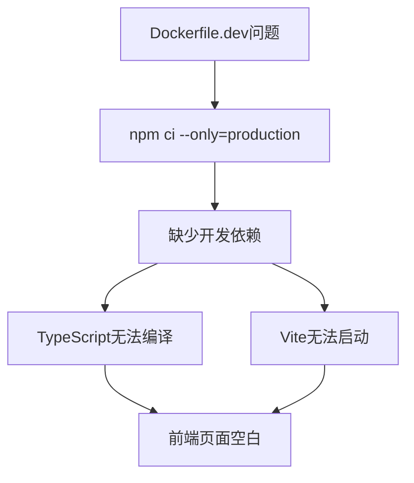

## Product Overview

修复前端Docker开发环境中无显示内容的问题。该问题导致前端页面空白，但后端API正常工作。

## Core Features

- 修复Dockerfile.dev中的依赖安装配置
- 确保TypeScript编译环境正常
- 恢复React开发服务器的正常运行
- 验证前端页面能够正确显示内容

## Tech Stack

- 容器化：Docker
- 前端框架：React + TypeScript
- 构建工具：Vite
- 包管理器：npm

## System Architecture

问题根源分析：Dockerfile.dev使用了`npm ci --only=production`参数，仅安装生产依赖，导致TypeScript、Vite等开发依赖缺失，前端无法正常编译和运行。

## Implementation Details

需要修改Dockerfile.dev文件，将依赖安装命令从`npm ci --only=production`改为`npm ci`，确保所有依赖（包括开发依赖）都被正确安装。

### Integration

- **cloudStudio** (已连接)
- Purpose: 用于验证修复后的Docker环境能否正常部署和运行
- Expected outcome: 确认修复后的前端在云环境中能够正常显示内容