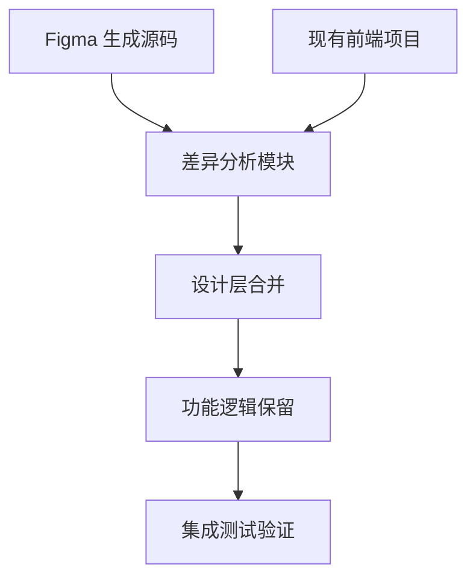
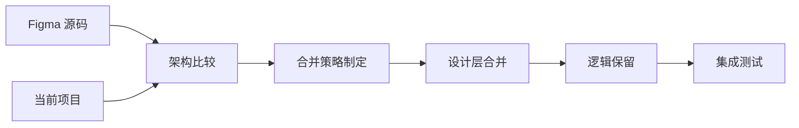

## 产品概述

将 Figma 生成的最新网页设计源码合并到现有前端项目，确保设计更新同时保留后端集成功能

## 核心功能

- 分析 Figma 生成源码与现有项目的技术架构差异
- 比较两个项目的 UI 设计和组件结构
- 识别并保留现有项目的后端调用逻辑
- 制定差异合并策略，确保功能完整性
- 实现设计更新与功能保留的无缝整合

## 技术栈分析

- 现有项目技术栈：待分析（基于 workspace_path i:/stockstudy）
- Figma 生成源码技术栈：待分析（基于 frontend_figma 文件夹）
- 合并策略：保留现有项目后端集成，更新前端设计层

## 架构设计

采用渐进式合并策略，确保前端设计层更新不影响后端业务逻辑



## 数据流设计



## 核心目录结构

```
stockstudy/
├── frontend_figma/          # Figma 生成源码
│   ├── components/          # 设计组件
│   ├── pages/               # 页面设计
│   └── styles/              # 样式文件
├── src/                     # 现有项目源码
│   ├── components/          # 现有组件（含后端逻辑）
│   ├── pages/               # 现有页面
│   ├── services/            # 后端服务调用
│   └── utils/               # 工具函数
└── merge_strategy/          # 合并策略文档
```

## 代理扩展

### SubAgent

- **code-explorer** (来自 <subagent>)
- 目的：深度分析 frontend_figma 文件夹和现有项目的代码结构差异
- 预期结果：生成详细的架构对比报告和合并建议

### Integration

- **cloudStudio** (来自 <integration>，状态：connected)
- 目的：在合并完成后快速部署验证版本
- 预期结果：创建可测试的合并版本实例
- **eop** (来自 <integration>，状态：connected)
- 目的：部署最终合并版本到生产环境
- 预期结果：完成设计更新后的项目部署