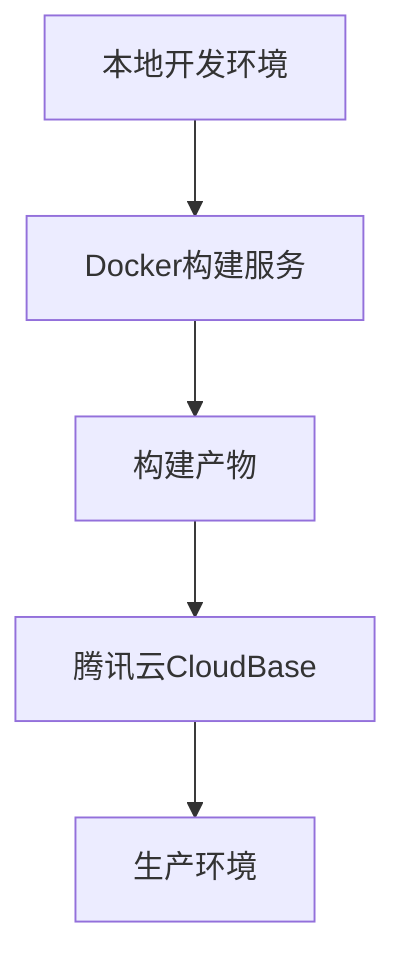
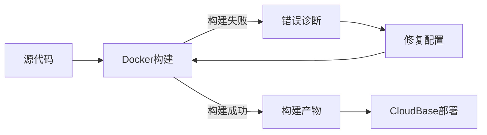

## 产品概述

修复股票趋势练习网站的前端构建错误，确保构建流程能够正常运行并部署到生产环境。

## 核心功能

- 诊断和修复Docker服务不可用问题
- 解决Docker API连接失败错误
- 优化前端构建配置和流程
- 确保生产环境部署的稳定性

## 技术栈

- 前端框架：基于现有项目技术栈
- 构建工具：Docker + Docker Compose
- 部署平台：腾讯云CloudBase
- 开发环境：本地开发环境

## 架构设计

### 系统架构

采用分层架构，分离构建环境和生产环境：



### 数据流



### 核心目录结构

```
stockstudy/
├── docker/              # Docker配置文件
├── src/                 # 前端源代码
├── build/               # 构建脚本
├── docker-compose.yml   # Docker编排配置
└── package.json         # 项目依赖配置
```

## 技术实现方案

1. **问题诊断**：分析Docker服务不可用的根本原因
2. **配置修复**：修复Docker API连接配置和权限设置
3. **构建优化**：优化前端构建流程和依赖管理
4. **部署验证**：验证构建产物能够正常部署到生产环境

## 使用的代理扩展

### SubAgent

- **code-explorer** (来自 <subagent>)
- 用途：深度分析项目代码结构，识别构建配置问题和依赖关系
- 预期结果：定位Docker配置错误和构建流程问题

### Integration

- **tcb** (来自 <integration>, 状态: connected)
- 用途：验证修复后的构建产物能否成功部署到腾讯云CloudBase
- 预期结果：确保生产环境部署流程正常

- **cloudStudio** (来自 <integration>, 状态: connected)
- 用途：提供快速部署验证，确保修复后的构建流程能够正常工作
- 预期结果：验证前端项目能够正常构建和部署