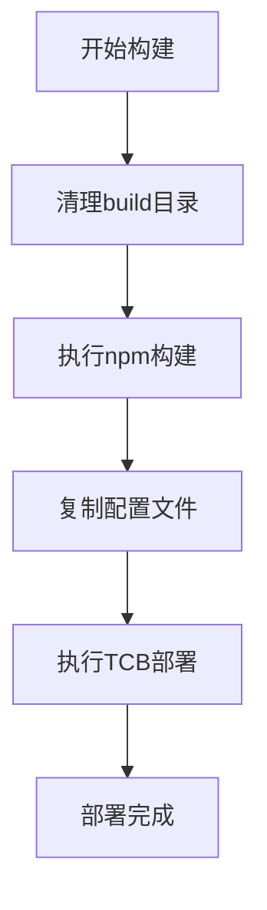

## 产品概述

修改build-frontend-cloudbase.bat批处理文件，统一构建输出目录并集成云部署功能

## 核心功能

- 统一使用build目录作为构建输出目录
- 集成TCB CLI部署命令到批处理文件中
- 确保stock-config.json配置文件在构建时正确复制到输出目录
- 实现一键构建和部署到云端的功能

## 技术栈

- 构建工具：Windows批处理脚本 (.bat)
- 云部署：腾讯云CloudBase CLI (tcb)
- 文件处理：Windows命令行工具 (xcopy, del等)

## 架构设计

### 系统架构

采用单文件批处理脚本架构，按顺序执行构建和部署流程



### 实现细节

#### 核心文件结构

```
stockstudy/
├── build-frontend-cloudbase.bat (修改后的批处理文件)
├── package.json
├── stock-config.json
└── build/ (统一构建输出目录)
```

#### 关键技术实现

- 目录清理和创建逻辑
- npm构建命令执行
- 配置文件复制机制
- TCB CLI部署命令集成
- 错误处理和状态检查

## 代理扩展

### 集成

- **tcb** (来自 <integration>)
- 目的：集成TCB CLI部署命令到批处理文件中
- 预期结果：实现一键部署到腾讯云CloudBase的功能
- **cloudStudio** (来自 <integration>)
- 目的：验证部署配置和流程
- 预期结果：确保部署配置正确，能够成功部署到云端